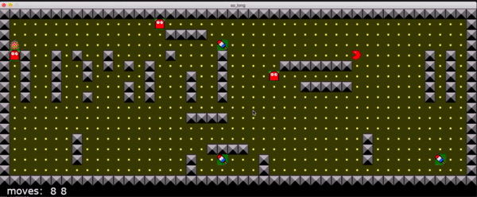

## So_long: a 2D game built with C

This is a simple 2D pac man like game built in C using a small graphics library called <a href="https://github.com/42Paris/minilibx-linux"> minilibx(mlx)</a>

### usage

```./so_long [map_file]```

### Demo 




